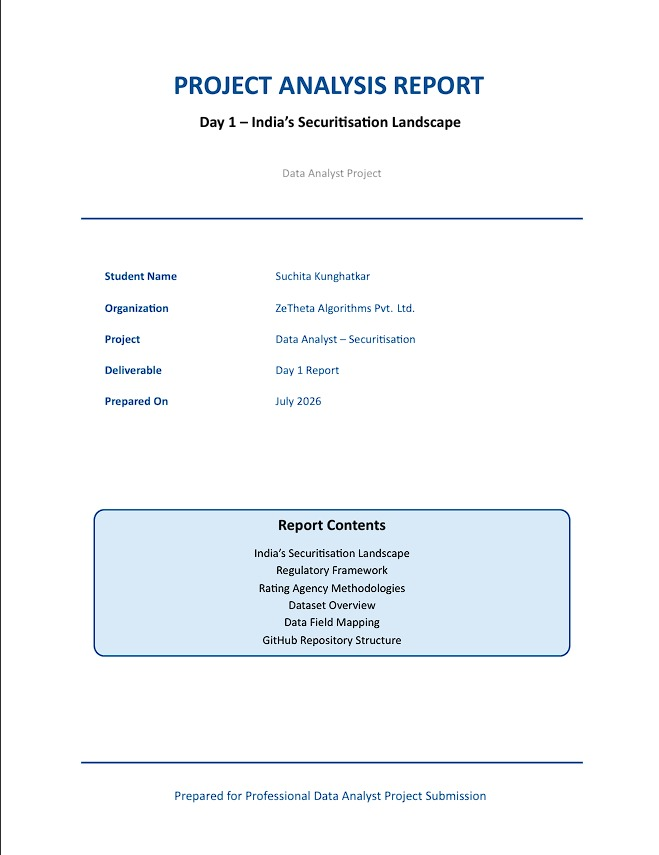

<div align="center">

# 📊 Day 1 – Securitisation Report

### Executive Summary of India's Securitisation Landscape


**A professional LaTeX report explaining India's securitisation ecosystem, regulatory framework, credit rating methodologies, datasets, business mapping, and analytical insights.**

</div>

---

# 📑 Table of Contents

- Overview
- Project Objectives
- Report Contents
- Report Preview
- Key Highlights
- Technologies Used
- Repository Structure
- How to View the Report
- Future Improvements

---

# 📖 Overview

This report provides a concise overview of **India's securitisation market**.

It explains:

- What securitisation is
- Why banks use securitisation
- RBI & SEBI regulations
- Credit Rating Agencies
- Dataset overview
- Business requirement mapping
- Expected analytical outputs
- Day 1 learning outcomes

The report was prepared using **LaTeX** for professional documentation.

---

# 🎯 Project Objectives

- Understand India's securitisation ecosystem
- Study the regulatory framework
- Explore credit rating methodologies
- Identify business requirements
- Map available datasets
- Understand analytical requirements
- Create professional documentation

---

# 📚 Report Contents

| Section | Description |
|---------|-------------|
| Introduction | Overview of India's securitisation market |
| Regulatory Framework | RBI, SEBI & governing regulations |
| Rating Agencies | CRISIL, Moody's, S&P methodologies |
| Dataset Overview | Available portfolio datasets |
| Data Field Mapping | Business requirements with datasets |
| Learning Outcome | Summary of key learnings |

---


# 📄 Cover Page

<p align="center">
  
</p>


---

# ✨ Key Highlights

- Professional LaTeX formatting
- Executive summary
- RBI & SEBI regulations
- Credit rating methodology
- Business requirement mapping
- Dataset analysis
- Portfolio analytics overview
- Power BI KPI planning
- Clean academic documentation

---

# 🛠 Technologies Used

| Technology | Purpose |
|------------|----------|
| LaTeX | Professional report writing |
| PDF | Final documentation |
| Financial Analysis | Securitisation study |
| GitHub | Version control |

---

# 📂 Repository Structure

```text
Day1-Securitisation-Report
│
├── images
│   ├── report-cover.png
│   ├── report-page1.png
│   └── report-page2.png
│
├── Day1_Securitisation_Report.pdf
├── README.md
│
├── cover.tex
├── introduction.tex
├── regulatory.tex
├── rating.tex
├── datasets.tex
├── mapping.tex
├── conclusion.tex
├── preamble.tex
└── main.tex
```

---

# 📥 How to View the Report

### Read Online

Open

```
Day1_Securitisation_Report.pdf
```

or download it directly from this repository.

---

# 📊 Project Statistics

| Item | Value |
|------|------:|
| Pages | 9 |
| Sections | 6 |
| Images | 3 |
| Report Format | PDF |
| Source Files | LaTeX |

---

# 🚀 Future Improvements

- Add Power BI dashboard
- Loan portfolio visualisations
- Credit risk analytics
- Interactive charts
- Performance KPI dashboard

---

<div align="center">

### ⭐ If you found this project useful, please consider giving it a star!

</div>
