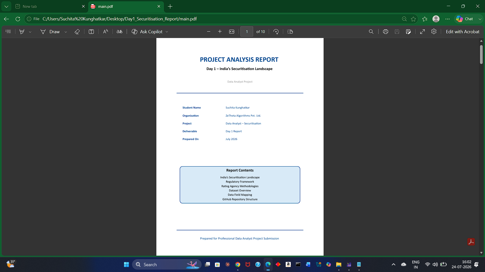

# 📊 Day 1 - Securitisation Report

<p align="center">


</p>

---

# 📖 Executive Summary of India's Securitisation Landscape

This repository contains my **Day 1 learning report** on the Indian Securitisation Market.

The report provides an overview of India's securitisation ecosystem, including regulatory authorities, credit rating methodologies, dataset mapping, expected analytical fields, and Power BI reporting requirements.

The document has been prepared using **LaTeX** and exported as a professional PDF.

---

# 📑 Table of Contents

- Project Overview
- Objectives
- Topics Covered
- Technologies Used
- Project Structure
- Report Preview
- Key Learnings
- Author

---

# 🎯 Project Overview

The objective of this report is to understand the fundamentals of the Indian securitisation market before beginning portfolio analytics and dashboard development.

The report covers:

- Overview of Securitisation
- Regulatory Framework
- Rating Agencies
- Dataset Overview
- Data Field Mapping
- Expected Power BI KPIs
- Day 1 Learning Outcome

---

# 📚 Topics Covered

✔ Introduction to Securitisation

✔ RBI Regulations

✔ SEBI Regulations

✔ NHB Guidelines

✔ Credit Rating Agencies

- CRISIL
- Moody's
- S&P Global

✔ Dataset Overview

✔ Business Requirement Mapping

✔ Loan Portfolio Fields

✔ Expected Dashboard KPIs

---

# 🛠 Technologies Used

- LaTeX
- TeXstudio
- PDF
- Financial Domain Research

---

# 📂 Project Structure

```
Day1-Securitisation-Report
│
├── images
│   ├── report-cover.png
│   └── report-page.png
│
├── README.md
├── Day1_Securitisation_Report.pdf
├── cover.tex
├── main.tex
├── preamble.tex
├── introduction.tex
├── regulatory.tex
├── rating.tex
├── datasets.tex
├── mapping.tex
└── conclusion.tex
```

---

# 🖼 Report Preview

## Cover Page

<p align="center">

</p>

---


# 📥 Report

You can read the complete report here:

📄 **Day1_Securitisation_Report.pdf**

---

# 💡 Key Learnings

- Understood India's Securitisation Market
- Learned RBI and SEBI regulations
- Studied Rating Agency methodologies
- Explored loan portfolio datasets
- Identified important analytical fields
- Understood expected Power BI KPIs
- Learned business requirement mapping

---

# 🚀 Future Work

The knowledge gained from this report will be used to:

- Portfolio Analytics
- Data Cleaning
- Exploratory Data Analysis (EDA)
- Power BI Dashboard Development
- Financial Risk Analytics

---

# 👩‍💻 Author

**Suchita Kunghatkar**

🎓 M.Sc. Mathematics

📊 Aspiring Data Analyst

💻 Python | SQL | Power BI | Machine Learning | LaTeX

---

⭐ If you found this project useful, consider giving it a star!
